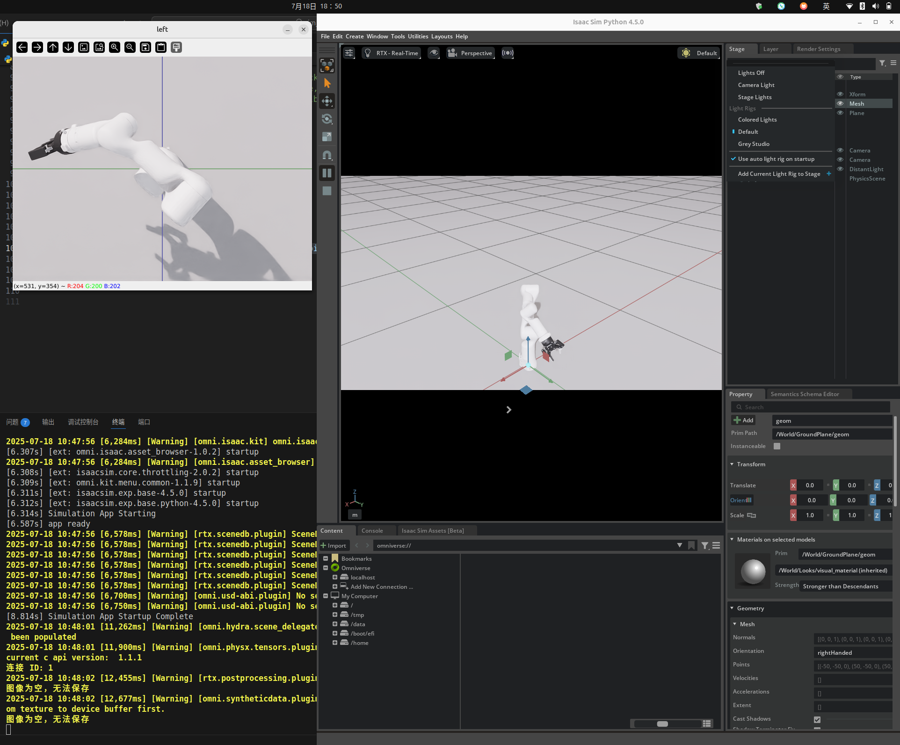
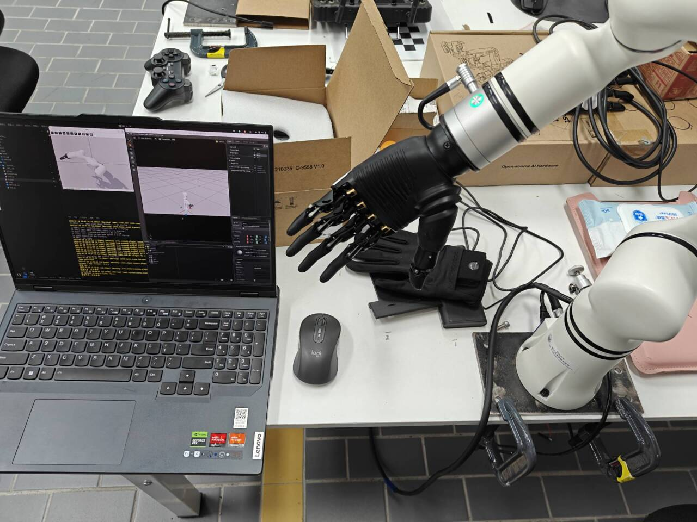

# sim_ACT_Env

## 项目简介

本项目用于遥操作机器人，主要面向睿尔曼 MR65 机械臂。仿真环境基于 NVIDIA Isaac Sim 4.5 搭建，支持远程控制、环境交互与算法测试。（PS：仅用于测试）

### 主要特性
- 支持 MR65 机械臂的遥操作与仿真
- 环境资产与机器人模型均采用 USD 格式
- 便于算法开发与测试

### 仿真环境
本项目依赖 Isaac Sim 4.5，需提前安装并配置相关环境。

### 目录结构
- `Env/asset/`：环境资产 USD 文件
- `Env/robot/`：机器人模型及配置
- `ulits/`：工具与功能模块

### 演示图片

